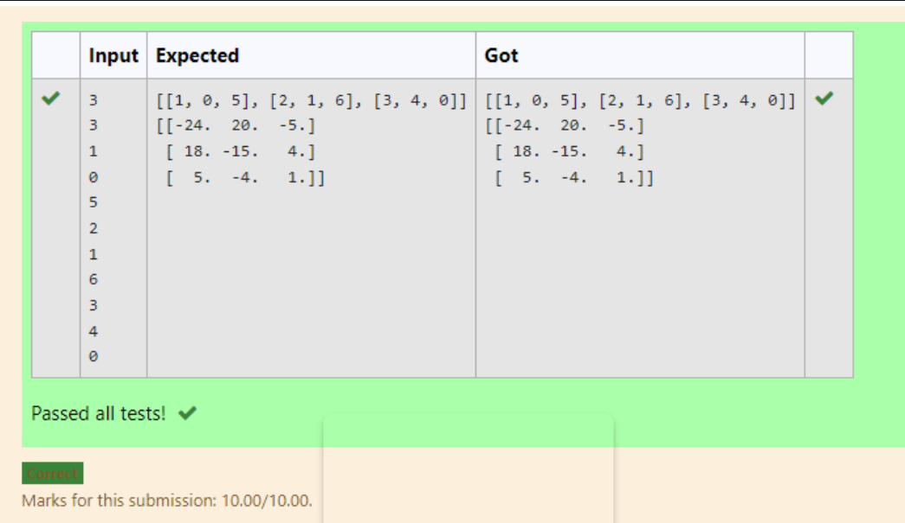

# Inverse-of-matrix

## AIM:
To write a python program for finding the inverse of a matrix

## ALGORITHM:
### Step 1:
Import numpy as np

### Step 2:
Create two empty lists and two variables for getting the values from the user.

### Step 3:
Create a nested for loop and iterate the values

### Step 4:
Find the inverse using np.linalg.inv(result)

### Step 5:
Print the values


## PROGRAM:
```
import numpy as np
list1,list2=[],[]
A,B=int(input()),int(input())
for i in range(A):
    for j in range(B):
        value=int(input())
        list1.append(value)
    list2.append(list1)
    list1=[]
print(list2)
result=np.array(list2)
inverse=np.linalg.inv(result)
print(inverse)
```

## OUTPUT:



## RESULT:
Thus the program is written and executed for finding the inverse of a matrix


